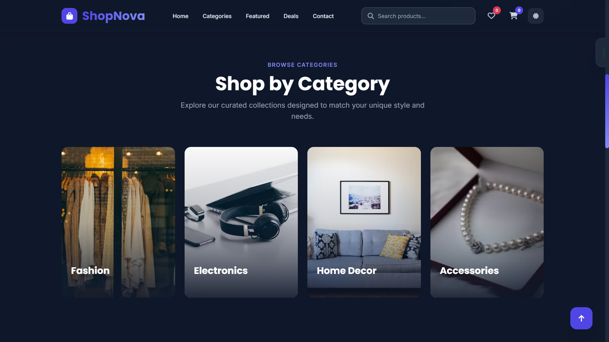
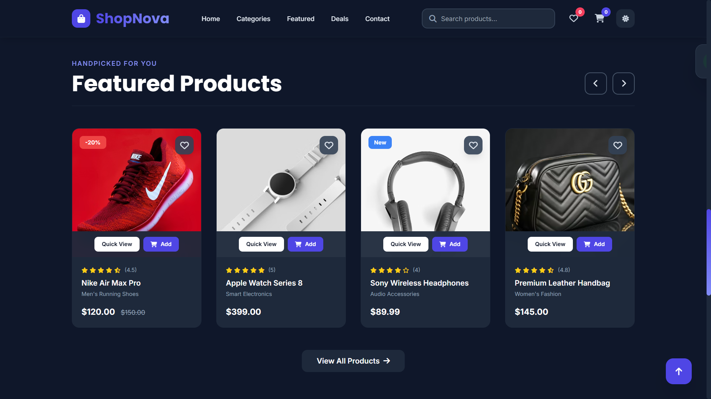

# 🛒 ShopNova - Premium E-Commerce Website

Welcome to the **ShopNova E-Commerce** project — a highly modern, responsive, and visually stunning online store interface designed to deliver an engaging and seamless shopping experience. 

This project showcases advanced e-commerce design patterns, beautiful product displays, interactive features, and user-friendly navigation with a strong focus on performance.

---

## 🖼️ Previews

Here is a glimpse of the modern interface and sleek design components:

### 📂 Categories Section


### ⭐ Featured Products


---

## 🎯 Purpose

This project serves as a comprehensive showcase of modern e-commerce frontend architecture. It demonstrates how to seamlessly blend utility-first CSS, dynamic JavaScript DOM manipulation, and scroll-triggered animations to build an attractive, high-converting, and user-centric digital storefront.

---

## ✨ Key Features

### 🎨 Modern E-Commerce UI/UX
- **Premium Layout:** Clean and professional online store layout with glassmorphism elements and gradient highlights.
- **Dynamic Product Showcase:** Featured products, category grids, and interactive product cards with quick action buttons.

### 🛍️ Core Shopping Features
- **Cart & Wishlist UI:** Real-time adding to cart/wishlist with animated notification pop-ups and counter badges.
- **Flash Deals:** Engaging promotional sections featuring an active countdown timer for limited-time offers.
- **Product Badges:** Dynamic tags for new arrivals, discounts (e.g., -20%), and hot items.

### 🌙 Adaptive Theming & Animations
- **Dark & Light Mode:** Seamless theme switching with system preference detection and local storage memory.
- **Scroll Animations:** Integrated **AOS (Animate On Scroll)** for smooth, staggered element reveals as you navigate.
- **Interactive Elements:** Smooth hover effects on buttons, images scaling, and custom CSS pulse animations.

### 📱 Fully Responsive Design
- **Mobile-First Approach:** Perfectly optimized for mobile devices, tablets, and large desktop screens.
- **Hidden Mobile Navigation:** Clean hamburger menu integration for smaller screens.

---

## 📂 Website Sections

- **Hero/Home Section** (Promotional banners & quick links)
- **Top Categories** (Grid showcase)
- **Flash Sales & Deals** (Countdown timer section)
- **Featured Products** (Interactive product cards)
- **Customer Testimonials** (Review and rating cards)
- **Footer Navigation** (Newsletter, links, and payment methods)

---

## ⚙️ Quick Start & Installation 📥

Follow these simple steps to view the project locally:

1. **Clone the Repository:**
```bash
  git clone https://github.com/iqbolshoh/frontend-ecommerce-website.git
```
Navigate to the Directory:

Bash
```bash
  cd frontend-ecommerce-website
```

## 🖥 Technologies Used


## 📜 License

This project is open-source and available under the **MIT License**.

## 🤝 Contributing

🎯 Contributions are welcome! If you have suggestions or want to enhance the project, feel free to fork the repository and submit a pull request.

## 📬 Connect with Me

💬 I love meeting new people and discussing tech, business, and creative ideas. Let’s connect! You can reach me on these platforms:

<div align="center">
  <table>
    <tr>
      <td>
        <a href="https://iqbolshoh.uz" target="_blank">
          
        </a>
      </td>
      <td>
        <a href="mailto:iilhomjonov777@gmail.com" target="_blank">
          
        </a>
      </td>
      <td>
        <a href="https://github.com/iqbolshoh" target="_blank">
          
        </a>
      </td>
      <td>
        <a href="https://www.linkedin.com/in/iqbolshoh/" target="_blank">
          
        </a>
      </td>
      <td>
        <a href="https://t.me/iqbolshoh_777" target="_blank">
          
        </a>
      </td>
      <td>
        <a href="https://wa.me/998997799333" target="_blank">
          
        </a>
      </td>
      <td>
        <a href="https://instagram.com/iqbolshoh_777" target="_blank">
          
        </a>
      </td>
      <td>
        <a href="https://x.com/iqbolshoh_777" target="_blank">
          
        </a>
      </td>
      <td>
        <a href="https://www.youtube.com/@Iqbolshoh_777" target="_blank">
          
        </a>
      </td>
    </tr>
  </table>
</div>
